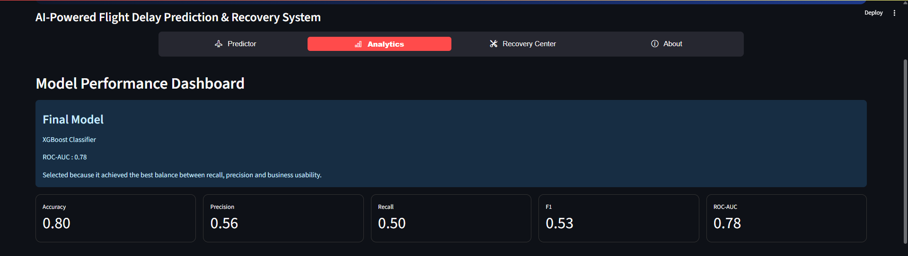
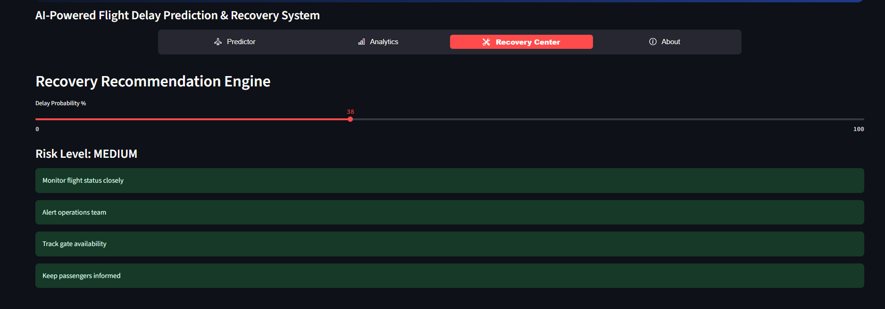

# ✈️ FlightWise AI

### AI-Powered Flight Delay Prediction & Recovery Intelligence System

<div align="center">


### 🚀 Predict Flight Delays Before Takeoff Using Machine Learning

</div>

---

## 🌍 Overview

FlightWise AI is an end-to-end Machine Learning project designed to predict whether a flight will arrive **15 minutes or more late**.

Built using **Python, XGBoost, Scikit-Learn, and Streamlit**, the project combines aviation analytics, feature engineering, and machine learning to help identify high-risk flights before departure.

### Key Highlights

* ✈️ Flight Delay Prediction
* 📊 Analytics Dashboard
* 🛠 Recovery Recommendation System
* 🤖 XGBoost-Based Prediction Engine
* 🌐 Interactive Streamlit Application
* 📈 Feature Importance Analysis

---

## 🎯 Business Problem

Flight delays negatively impact:

* Passengers
* Airlines
* Airport Operations
* Crew Scheduling
* Revenue Generation

The goal of this project is to proactively identify flights likely to be delayed so operational teams can take preventive actions.

---

## 📊 Dataset Information

| Attribute         | Value                                     |
| ----------------- | ----------------------------------------- |
| Source            | Bureau of Transportation Statistics (BTS) |
| Time Period       | January 2024                              |
| Flights           | 558,715                                   |
| Original Features | 24                                        |
| Final Features    | 194                                       |
| Target Variable   | ArrDel15                                  |

---

## 🎯 Target Variable

### ArrDel15

| Value | Meaning                      |
| ----- | ---------------------------- |
| 0     | On-Time Flight               |
| 1     | Delayed Flight (15+ Minutes) |

This is a Binary Classification problem.

---

## 🔄 Project Workflow

```text
Raw Flight Dataset
        │
        ▼
Data Cleaning
        │
        ▼
Exploratory Data Analysis
        │
        ▼
Feature Engineering
        │
        ▼
Encoding & Transformation
        │
        ▼
Train-Test Split
        │
        ▼
Model Building
        │
        ▼
Model Evaluation
        │
        ▼
Model Selection
        │
        ▼
Streamlit Deployment
```

---

## 📈 Exploratory Data Analysis

Performed analysis on:

### Airlines

* Delay distribution by airline
* Airline traffic patterns

### Airports

* High traffic airports
* Airport congestion trends

### Routes

* Most common routes
* Route delay behavior

### Time-Based Analysis

* Day of Week
* Weekend vs Weekday
* Departure Hour
* Arrival Hour

### Correlation Analysis

Generated heatmaps to understand relationships among numerical variables.

---

## ⚙️ Feature Engineering

A major focus of this project was creating meaningful aviation-specific features.

### Time Features

* DepartureHour
* ArrivalHour
* IsWeekend

### Traffic Features

* OriginTraffic
* DestTraffic

### Frequency Features

* Origin_Freq
* Dest_Freq
* Route_Freq

### Route Features

* Distance
* FlightDurationCategory

### Time Block Features

Examples:

```text
0600-0659
0700-0759
0800-0859
```

### Location Features

* Origin State
* Destination State

---

## 🤖 Machine Learning Models

Three machine learning models were trained and evaluated.

### 1️⃣ Logistic Regression

Baseline classification model.

### 2️⃣ Random Forest

Ensemble tree-based classifier.

### 3️⃣ XGBoost ⭐

Final selected model due to superior performance.

---

## 🏆 Model Performance

| Metric    | Score |
| --------- | ----- |
| Accuracy  | 80%   |
| Precision | 56%   |
| Recall    | 50%   |
| F1 Score  | 53%   |
| ROC-AUC   | 0.78  |

---

## 📈 Why XGBoost?

XGBoost achieved the best balance between:

* Accuracy
* Recall
* Precision
* Operational Usability
* ROC-AUC Performance

Therefore it was selected as the production model.

---

## 🔥 Top Predictive Factors

Some of the most important variables influencing delay probability:

* Route Delay Rate
* Airline
* Departure Hour
* Origin Traffic
* Destination Traffic
* Route Frequency
* Origin State
* Destination State

---

# 🌐 FlightWise Web Application

The project includes a fully interactive Streamlit dashboard.

---

## ✈️ Flight Delay Predictor

Users can select:

* Airline
* Origin Airport
* Destination Airport
* Flight Date
* Departure Time

The application automatically determines:

* Distance
* Duration
* Arrival Time

and predicts delay probability.

---

## 📊 Analytics Dashboard

Displays:

* Accuracy
* Precision
* Recall
* F1 Score
* ROC-AUC

Plus:

* Feature Importance Visualization

---

## 🛠 Recovery Center

Provides recommendations based on predicted delay risk.

### Low Risk

Routine Monitoring

### Medium Risk

Operational Alerts

### High Risk

Recovery Planning & Passenger Communication

---

# 📸 Application Screenshots

## Flight Delay Predictor


---

## Analytics Dashboard



---

## Recovery Center



---

# 📂 Repository Structure

```text
FlightWise-AI/
│
├── app.py
├── utils.py
├── requirements.txt
│
├── data/
│   └── model_comparison.csv
│
├── datasets/
│   ├── data.csv
│   └── data1.csv
│
├── models/
│   ├── airline_routes.pkl
│   ├── airlines.pkl
│   ├── dest_freq.pkl
│   ├── dest_state.pkl
│   ├── dest_traffic.pkl
│   ├── destinations.pkl
│   ├── flight_delay_model.pkl
│   ├── metrics.pkl
│   ├── model_columns.pkl
│   ├── origin_freq.pkl
│   ├── origin_state.pkl
│   ├── origin_traffic.pkl
│   ├── origins.pkl
│   ├── route_distance.pkl
│   ├── route_duration.pkl
│   └── route_freq.pkl
│
├── notebooks/
│
└── screenshots/
    ├── analytics.png
    ├── prediction_result.png
    └── recovery_center.png
```

---

## ⚡ Installation

Clone the repository:

```bash
git clone https://github.com/kjuhi-18/FlightWise-AI.git
```

Navigate to the project directory:

```bash
cd FlightWise-AI
```

Install dependencies:

```bash
pip install -r requirements.txt
```

---

## ▶️ Run The Application

```bash
streamlit run app.py
```

The application will launch locally at:

```text
http://localhost:8501
```

---

## 🚀 Future Improvements

* Real-Time Weather Integration
* FAA Flight APIs
* Airport Congestion Forecasting
* Delay Cause Classification
* Real-Time Flight Tracking
* Deep Learning Models
* Dynamic Route Optimization

---

## 📚 Skills Demonstrated

* Data Cleaning
* Exploratory Data Analysis
* Feature Engineering
* Machine Learning
* Model Evaluation
* XGBoost
* Streamlit Development
* Model Deployment
* Aviation Analytics

---

## 👨‍💻 Author

### Kunal Jhindal

**B.Tech – Artificial Intelligence & Machine Learning**

Interested in:

* Machine Learning
* Data Science
* Artificial Intelligence
* Analytics Applications

---

<div align="center">

### ⭐ If you found this project interesting, consider giving it a star!

### ✈️ FlightWise AI — Predicting Delays Before Takeoff

</div>
